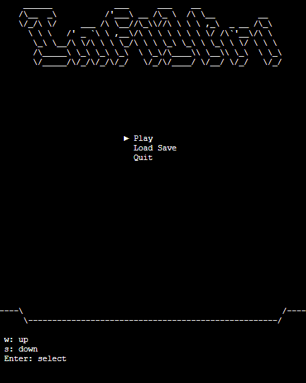

# Infiltri

Dungeon Crawler Roguelike. Infiltri is the esperanto form for 

## Requirements

- Java 21 or later
- Console that support ANSI escape codes

## Play

Commands are located on the bottom of the screen. After selecting a charachter, you enter the area menu where you can select an area ot move to, or exit to the world map to change areas.

> [!NOTE]
> Infiltri is currently fully playable, but incomplete, and it needs some more balancing.
